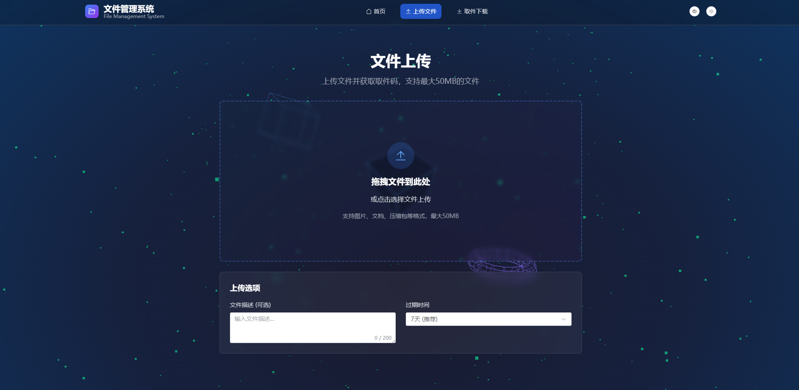
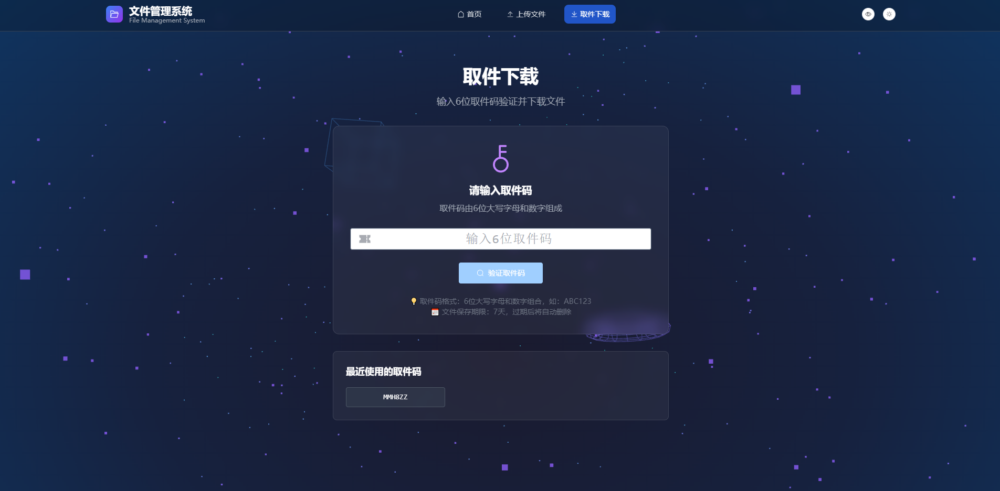
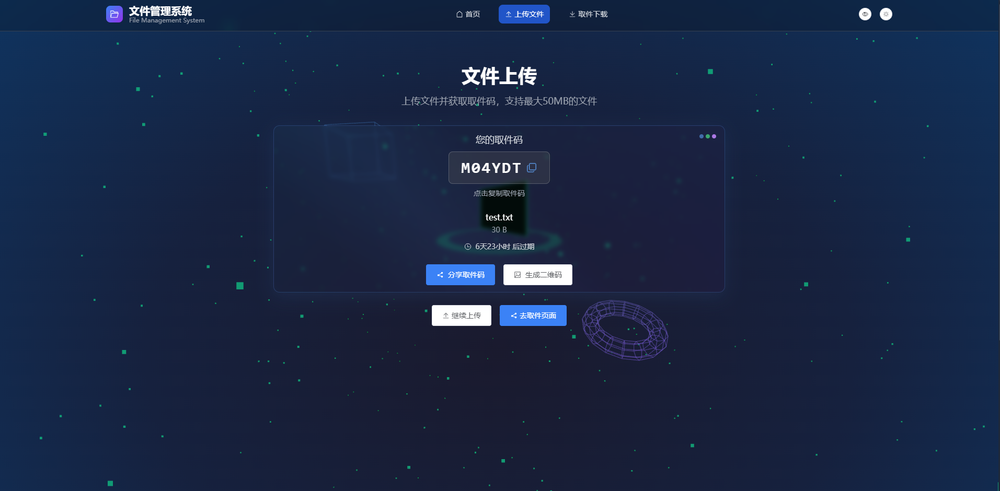
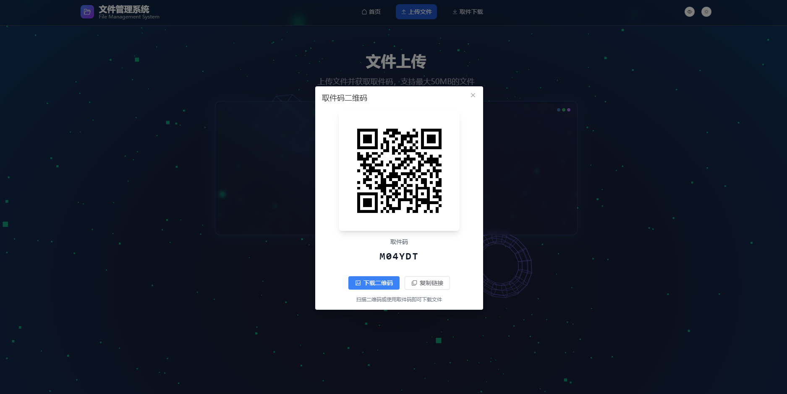
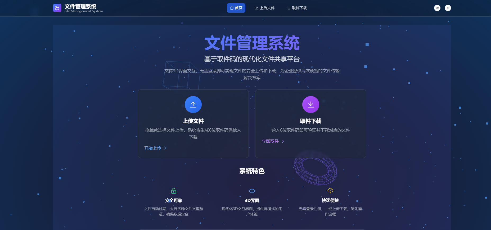
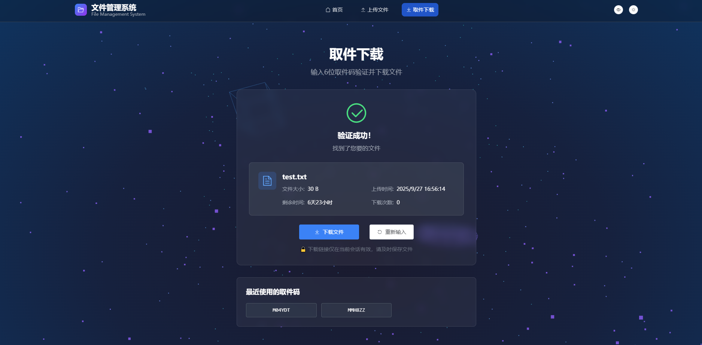

# 🌟 FileSystem - 3D File Sharing System

[](https://opensource.org/licenses/MIT)
[](https://nodejs.org/)
[](https://vuejs.org/)

A modern file sharing system with pickup code mechanism, enabling file upload and download without login, featuring stunning 3D interface and QR code functionality.

English | [中文](README.md)

## ✨ Features

- 🎯 **Easy to Use** - User A uploads file and gets pickup code, User B downloads with the code
- 🎨 **3D Interface** - Modern 3D interactive interface based on Three.js
- 📱 **QR Code Support** - Auto-generate pickup QR codes, mobile-friendly scanning
- 🔒 **Secure & Reliable** - Auto file expiration, multiple file type validation
- 📱 **Responsive Design** - Perfect support for desktop and mobile
- ⚡ **High Performance** - Optimized 3D rendering and file processing
- 🐳 **Containerized Deployment** - One-click Docker deployment

## 🚀 Tech Stack

### Frontend
- **Vue 3.4+** - Modern frontend framework
- **TypeScript** - Type safety
- **Three.js** - 3D graphics rendering
- **Vite** - Fast build tool
- **Pinia** - State management
- **Tailwind CSS** - Atomic CSS
- **GSAP** - High-performance animations

### Backend
- **Node.js 18+** - Server runtime
- **Express.js** - Web framework
- **Multer** - File upload handling
- **Winston** - Logging
- **QRCode** - QR code generation

## 📁 Project Structure

```
FileSystem/
├── frontend/          # Vue3 frontend app
├── backend/           # Node.js backend API
├── docs/             # Project documentation
├── docker-compose.yml # Docker deployment
└── README.md         # Project documentation
```

## 🛠️ Development Setup

### Requirements
- Node.js 18+
- npm or yarn
- Modern browser (WebGL support)

### Install Dependencies
```bash
# Install backend dependencies
cd backend
npm install

# Install frontend dependencies
cd ../frontend
npm install
```

### Development
```bash
# Start backend (in backend directory)
npm run dev

# Start frontend (in frontend directory)
npm run dev
```

Visit `http://localhost:5173` to see the application.

## 🐳 Docker Deployment

### Quick Start
```bash
# Clone the repository
git clone https://github.com/pe0ny9-a/FileSystem.git
cd FileSystem

# Start with Docker Compose
docker-compose up -d
```

### Production Deployment
```bash
# Copy production environment file
cp backend/env.production.example backend/.env.production

# Edit configuration
nano backend/.env.production

# Deploy
docker-compose -f docker-compose.yml up -d
```

## 📖 API Documentation

### File Upload
```bash
POST /api/files/upload
Content-Type: multipart/form-data

# Response
{
  "success": true,
  "data": {
    "pickupCode": "ABC123",
    "expiresAt": "2025-10-04T12:00:00Z"
  }
}
```

### File Download
```bash
GET /api/files/download/ABC123

# Response: File stream
```

### QR Code Generation
```bash
GET /api/qr/generate/ABC123

# Response
{
  "success": true,
  "data": {
    "qrData": "data:image/png;base64,...",
    "pickupUrl": "https://yoursite.com/pickup?code=ABC123"
  }
}
```

## 🖼️ Screenshots

### 📤 File Upload Interface


### 📥 File Download Interface


### 🔑 Pickup Code Display


### 📱 QR Code Generation


### 🏠 System Homepage


### 📥 Download Confirmation


## 🔧 Configuration

### Environment Variables
```bash
NODE_ENV=production
PORT=3000
FRONTEND_URL=https://your-domain.com
MAX_FILE_SIZE=104857600
SESSION_SECRET=your-secret-key
```

### Security Settings
- File size limit (100MB)
- Pickup code auto-expiration (7 days)
- Request rate limiting
- Malicious file detection

## 🤝 Contributing

We welcome all forms of contributions! Please check our [Contributing Guide](CONTRIBUTING.md) to learn how to participate.

### Contributors

Thanks to all developers who contributed to this project!

<a href="https://github.com/pe0ny9-a/FileSystem/graphs/contributors">
  
</a>

## 🐛 Issues

If you find bugs or have feature suggestions, please contact us through:

- [GitHub Issues](https://github.com/pe0ny9-a/FileSystem/issues)
- [Discussions](https://github.com/pe0ny9-a/FileSystem/discussions)

## 🔒 Security

Please check our [Security Policy](SECURITY.md) to learn how to report security vulnerabilities.

## 📝 Changelog

### v1.0.0 (2025-09-27)
- ✅ Complete file upload/download functionality
- ✅ 3D interactive interface implementation
- ✅ QR code generation and scanning
- ✅ Docker containerized deployment
- ✅ Comprehensive security mechanisms

## 📄 License

This project is licensed under the [MIT License](LICENSE) - see the LICENSE file for details.

## ⭐ Star History

[](https://star-history.com/#pe0ny9-a/FileSystem&Date)

## 📞 Contact

- Project Homepage: https://github.com/pe0ny9-a/FileSystem
- Email: pikachu237325@163.com

---

If this project helps you, please give us a ⭐ Star!

---

💡 **Tip**: This is a modern file management system that combines practicality with visual impact, providing a brand new experience for enterprise file sharing!
